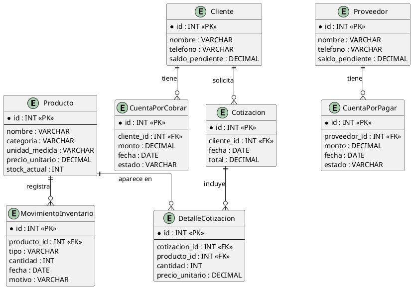

# VitroStock

**Sistema de gestión de inventario y contabilidad para Vidrios y Aluminios Estelar**

Proyecto académico — Electiva V, Universidad del Mayor.

---

## 1. Planteamiento del proyecto

### Cliente

Vidrios y Aluminios Estelar, negocio dedicado a la venta de vidrios, perfiles de aluminio y accesorios relacionados.

### Problemática

Actualmente el control de inventario se lleva en Excel y la contabilidad (ventas, cuentas por cobrar y por pagar) se registra manualmente en cuadernos. Esto genera riesgo de errores humanos, pérdida de información, dificultad para conocer el stock real en tiempo real, y falta de trazabilidad de pagos pendientes con clientes y proveedores.

### Objetivo

Desarrollar un sistema básico de gestión de inventario y contabilidad que permita registrar productos, controlar entradas y salidas de stock, generar cotizaciones simples, y llevar un registro digital de cuentas por cobrar y por pagar.

### Alcance

El proyecto se desarrolla de forma individual, asumiendo todos los roles: análisis, diseño, desarrollo, pruebas, QA y gestión.

---

## 2. Requisitos

### 2.1 Requisitos funcionales

| ID | Descripción |
|---|---|
| RF01 | El sistema debe permitir registrar productos (vidrios, perfiles de aluminio, accesorios) con nombre, categoría, unidad de medida y precio. |
| RF02 | El sistema debe permitir registrar entradas de inventario (compras a proveedores) para actualizar el stock. |
| RF03 | El sistema debe permitir registrar salidas de inventario (ventas) descontando automáticamente del stock. |
| RF04 | El sistema debe permitir consultar el stock actual de cada producto. |
| RF05 | El sistema debe permitir generar una cotización básica para un cliente. |
| RF06 | El sistema debe permitir registrar y consultar cuentas por cobrar a clientes. |
| RF07 | El sistema debe permitir registrar y consultar cuentas por pagar a proveedores. |
| RF08 | El sistema debe generar un reporte simple de movimientos del día/mes. |

### 2.2 Requisitos no funcionales

| ID | Descripción |
|---|---|
| RNF01 | El sistema debe ser accesible desde un navegador web estándar. |
| RNF02 | El tiempo de respuesta de las consultas no debe superar los 3 segundos. |
| RNF03 | El sistema debe tener una interfaz sencilla e intuitiva, pensada para usuarios sin experiencia técnica. |
| RNF04 | Los datos deben respaldarse periódicamente para evitar pérdida de información. |
| RNF05 | El sistema debe permitir el acceso mediante usuario y contraseña. |

### 2.3 Historias de usuario

| ID | Historia |
|---|---|
| HU01 | Como administrador, quiero registrar productos (vidrios, perfiles de aluminio, accesorios) con nombre, categoría, unidad de medida y precio, para tener un catálogo organizado. |
| HU02 | Como administrador, quiero registrar entradas de inventario, para mantener el stock actualizado. |
| HU03 | Como administrador, quiero registrar salidas de inventario, para descontar automáticamente del stock disponible. |
| HU04 | Como administrador, quiero consultar el stock actual de cada producto, para saber qué hay disponible sin revisar Excel manualmente. |
| HU05 | Como administrador, quiero generar una cotización básica para un cliente, para agilizar la atención en el mostrador. |
| HU06 | Como administrador, quiero registrar cuentas por cobrar a clientes, para saber quién debe y cuánto. |
| HU07 | Como administrador, quiero registrar cuentas por pagar a proveedores, para no perder el control de las deudas del negocio. |
| HU08 | Como administrador, quiero ver un reporte simple de movimientos del día/mes, para tener una visión general del negocio. |

#### Criterios de aceptación

**HU01 — Registrar productos**
- El sistema permite ingresar nombre, categoría, unidad de medida y precio unitario.
- El sistema asigna un identificador único a cada producto.
- El producto queda visible en el listado de inventario tras registrarse.

**HU02 — Registrar entradas de inventario**
- El sistema permite seleccionar un producto existente y agregar una cantidad de entrada.
- El stock del producto se actualiza automáticamente al registrar la entrada.
- Queda registrada la fecha y el motivo del movimiento.

**HU03 — Registrar salidas de inventario**
- El sistema permite seleccionar un producto existente y agregar una cantidad de salida.
- El stock del producto se descuenta automáticamente al registrar la salida.
- El sistema no permite una salida mayor al stock disponible.

**HU04 — Consultar stock actual**
- El sistema muestra un listado con producto, categoría y stock actual.
- El listado se actualiza en tiempo real tras cada entrada o salida registrada.
- Se puede filtrar o buscar por nombre de producto.

**HU05 — Generar cotización**
- El sistema permite seleccionar un cliente y agregar productos con cantidades.
- El sistema calcula automáticamente el total de la cotización.
- La cotización queda guardada con fecha y cliente asociado.

**HU06 — Registrar cuentas por cobrar**
- El sistema permite registrar un monto pendiente asociado a un cliente.
- El sistema permite marcar una cuenta como pagada.
- Se puede consultar el listado de cuentas pendientes por cliente.

**HU07 — Registrar cuentas por pagar**
- El sistema permite registrar un monto pendiente asociado a un proveedor.
- El sistema permite marcar una cuenta como pagada.
- Se puede consultar el listado de cuentas pendientes por proveedor.

**HU08 — Ver reporte de movimientos**
- El sistema muestra un listado de entradas y salidas de inventario en un rango de fechas.
- El reporte incluye totales de entradas, salidas y saldo actual.
- Se puede filtrar el reporte por día o por mes.

---

## 3. Diseño de interfaz

Wireframes definidos para el Sprint 0:

| Pantalla | Contenido |
|---|---|
| Login | Campos de usuario y contraseña, botón de acceso, mensaje de error en credenciales inválidas. |
| Dashboard / Inicio | Resumen de productos con stock bajo, cuentas por cobrar pendientes y cuentas por pagar pendientes. |
| Inventario | Listado con producto, categoría, stock actual y opción para registrar entradas/salidas. |
| Cotización | Selección de cliente, productos con cantidad y precio, cálculo de total, botón para generar/guardar. |
| Cuentas por cobrar/pagar | Listado con cliente/proveedor, monto, fecha y estado (pendiente/pagado). |

---

## 4. Modelo de datos

### 4.1 Entidades y atributos

| Entidad | Atributos |
|---|---|
| Producto | id, nombre, categoría, unidad_medida, precio_unitario, stock_actual |
| MovimientoInventario | id, producto_id, tipo (entrada/salida), cantidad, fecha, motivo |
| Cliente | id, nombre, teléfono, saldo_pendiente |
| Proveedor | id, nombre, teléfono, saldo_pendiente |
| CuentaPorCobrar | id, cliente_id, monto, fecha, estado |
| CuentaPorPagar | id, proveedor_id, monto, fecha, estado |
| Cotización | id, cliente_id, fecha, total |
| DetalleCotización | id, cotizacion_id, producto_id, cantidad, precio_unitario |

### 4.2 Relaciones y cardinalidades

- Un **Producto** puede tener muchos **MovimientoInventario** (1:N)
- Un **Cliente** puede tener muchas **CuentaPorCobrar** (1:N)
- Un **Proveedor** puede tener muchas **CuentaPorPagar** (1:N)
- Un **Cliente** puede tener muchas **Cotización** (1:N)
- Una **Cotización** puede incluir muchos **Producto**, mediante **DetalleCotización** (N:M)

### 4.3 Diagrama entidad-relación (PlantUML)



---

## 5. Gestión del proyecto (Jira)

### 5.1 Sprint 0 — Análisis y diseño

| Épica | Historias |
|---|---|
| Análisis de requisitos | Reunión con el cliente · Documentar requisitos funcionales · Documentar requisitos no funcionales · Redactar historias de usuario |
| Diseño de interfaz (wireframes) | Wireframe de login · dashboard · inventario · cotización · cuentas por cobrar/pagar |
| Modelo de datos | Definir entidades y atributos · Definir relaciones entre entidades · Elaborar diagrama ER |

#### Tasks por historia (Sprint 0)

**Reunión con el cliente**
- Preparar preguntas para la entrevista
- Realizar entrevista y documentar hallazgos

**Documentar requisitos funcionales**
- Redactar borrador de requisitos funcionales
- Revisar y validar requisitos funcionales

**Documentar requisitos no funcionales**
- Identificar restricciones técnicas del negocio
- Redactar requisitos no funcionales

**Redactar historias de usuario**
- Convertir requisitos funcionales en historias de usuario
- Revisar historias de usuario

**Cada wireframe**
- Definir elementos necesarios en la pantalla
- Dibujar boceto en herramienta de diseño

**Modelo de datos**
- Identificar entidades a partir de los requisitos
- Definir atributos de cada entidad
- Analizar cómo se conectan las entidades
- Definir cardinalidades
- Dibujar diagrama ER en herramienta visual

### 5.2 Sprint 1 — Módulo de Inventario

Historias priorizadas: **HU01, HU02, HU03, HU04** (núcleo del sistema; las demás dependen de estas).

#### Tasks del Sprint 1

**HU01 — Registrar productos**
- Crear formulario de registro de producto
- Implementar generación automática de ID
- Mostrar producto en listado de inventario

**HU02 — Registrar entradas de inventario**
- Crear formulario de entrada de inventario
- Implementar actualización automática de stock (entrada)
- Registrar fecha y motivo del movimiento

**HU03 — Registrar salidas de inventario**
- Crear formulario de salida de inventario
- Implementar actualización automática de stock (salida)
- Validar stock disponible antes de la salida

**HU04 — Consultar stock actual**
- Crear vista de listado de stock
- Implementar actualización en tiempo real del listado
- Agregar buscador/filtro por nombre

### 5.3 Backlog — Sprint 2

HU05 (cotizaciones), HU06 y HU07 (cuentas por cobrar/pagar), HU08 (reportes).

---

## 6. Backend

### 6.1 Stack

- Node.js + Express
- SQLite (base de datos en archivo local, sin servidor aparte)
- CORS habilitado para conexión con el frontend

### 6.2 Endpoints implementados

| Método | Ruta | Función |
|---|---|---|
| GET | `/productos` | Lista todos los productos |
| GET | `/productos/:id` | Consulta un producto específico |
| GET | `/hello/:nombre` | Mensaje personalizado según la URL |
| POST | `/productos` | Crea un producto (valida nombre y precio) |
| PUT | `/productos/:id` | Actualiza un producto (valida nombre y precio) |
| DELETE | `/productos/:id` | Elimina un producto |

### 6.3 Validación de datos

Antes de procesar POST y PUT, se valida que:
- `nombre` exista, sea texto y no esté vacío
- `precio` exista, sea numérico y mayor a 0

Si falla, responde `400 Bad Request` con el detalle de los errores.

### 6.4 Código del backend

```javascript
const express = require('express');
const sqlite3 = require('sqlite3').verbose();

const app = express();
const PORT = 3000;

app.use(express.json());

const db = new sqlite3.Database('./vitrostock.db', (err) => {
  if (err) {
    console.error('Error al conectar con la base de datos:', err.message);
  } else {
    console.log('Conectado a la base de datos SQLite (vitrostock.db)');
  }
});

db.run(`
  CREATE TABLE IF NOT EXISTS productos (
    id INTEGER PRIMARY KEY AUTOINCREMENT,
    nombre TEXT NOT NULL,
    categoria TEXT,
    precio REAL NOT NULL,
    stock INTEGER DEFAULT 0
  )
`);

// GET personalizado por URL
app.get('/hello/:nombre', (req, res) => {
  const { nombre } = req.params;
  res.send(`¡Hola, ${nombre}!`);
});

// GET - Listar todos los productos
app.get('/productos', (req, res) => {
  db.all('SELECT * FROM productos', [], (err, rows) => {
    if (err) return res.status(500).json({ error: err.message });
    res.json(rows);
  });
});

// GET - Obtener un producto por id
app.get('/productos/:id', (req, res) => {
  const { id } = req.params;
  db.get('SELECT * FROM productos WHERE id = ?', [id], (err, row) => {
    if (err) return res.status(500).json({ error: err.message });
    if (!row) return res.status(404).json({ error: 'Producto no encontrado' });
    res.json(row);
  });
});

// Validación
function validarProducto(body) {
  const errores = [];
  if (!body.nombre || typeof body.nombre !== 'string' || body.nombre.trim() === '') {
    errores.push('El campo "nombre" es obligatorio y debe ser un texto válido.');
  }
  if (body.precio === undefined || body.precio === null || isNaN(body.precio) || Number(body.precio) <= 0) {
    errores.push('El campo "precio" es obligatorio y debe ser un número mayor a 0.');
  }
  return errores;
}

// POST - Crear producto
app.post('/productos', (req, res) => {
  const errores = validarProducto(req.body);
  if (errores.length > 0) return res.status(400).json({ errores });

  const { nombre, categoria, precio, stock } = req.body;

  db.run(
    'INSERT INTO productos (nombre, categoria, precio, stock) VALUES (?, ?, ?, ?)',
    [nombre, categoria || null, precio, stock || 0],
    function (err) {
      if (err) return res.status(500).json({ error: err.message });
      res.status(201).json({
        id: this.lastID,
        nombre,
        categoria: categoria || null,
        precio,
        stock: stock || 0
      });
    }
  );
});

// PUT - Actualizar producto
app.put('/productos/:id', (req, res) => {
  const { id } = req.params;
  const errores = validarProducto(req.body);
  if (errores.length > 0) return res.status(400).json({ errores });

  const { nombre, categoria, precio, stock } = req.body;

  db.run(
    'UPDATE productos SET nombre = ?, categoria = ?, precio = ?, stock = ? WHERE id = ?',
    [nombre, categoria || null, precio, stock || 0, id],
    function (err) {
      if (err) return res.status(500).json({ error: err.message });
      if (this.changes === 0) return res.status(404).json({ error: 'Producto no encontrado' });
      res.json({ id: Number(id), nombre, categoria: categoria || null, precio, stock: stock || 0 });
    }
  );
});

// DELETE - Eliminar producto
app.delete('/productos/:id', (req, res) => {
  const { id } = req.params;
  db.run('DELETE FROM productos WHERE id = ?', [id], function (err) {
    if (err) return res.status(500).json({ error: err.message });
    if (this.changes === 0) return res.status(404).json({ error: 'Producto no encontrado' });
    res.status(200).json({ mensaje: `Producto con id ${id} eliminado correctamente.` });
  });
});

app.listen(PORT, () => {
  console.log(`Servidor de VitroStock corriendo en http://localhost:${PORT}`);
});
```

### 6.5 Instalación y ejecución

```bash
npm install express sqlite3 cors --save
node app.js
```

El archivo `vitrostock.db` se crea automáticamente en la carpeta del proyecto la primera vez que se ejecuta. SQLite no requiere instalar un servidor aparte: la base de datos es un archivo local.

---

## 7. Conceptos: REST, RESTful y API

| Concepto | Definición |
|---|---|
| **API** | Interfaz que permite que dos sistemas de software se comuniquen entre sí, sin importar el protocolo o arquitectura usada. |
| **REST** | Estilo arquitectónico (conjunto de principios de diseño) para construir servicios web, propuesto por Roy Fielding en el año 2000. |
| **RESTful** | Adjetivo que describe una API que cumple con los principios de REST. |

### Características de una API RESTful

1. **Cliente-servidor**: separación entre quien consume (frontend) y quien provee los datos (backend).
2. **Sin estado (stateless)**: cada solicitud contiene toda la información necesaria; el servidor no guarda sesión entre peticiones.
3. **Uso de métodos HTTP estándar**: GET, POST, PUT, DELETE, cada uno con una función clara.
4. **Recursos identificados por URL**: cada recurso tiene su propia URL única (`/productos/1`).
5. **Representación de recursos**: el intercambio de datos se hace en un formato estándar, usualmente JSON.
6. **Cacheable**: las respuestas pueden marcarse como cacheables para mejorar el rendimiento.
7. **Interfaz uniforme**: todos los endpoints siguen las mismas convenciones de nombres y comportamiento.

**Referencia:** Fielding, R. (2000). *Architectural Styles and the Design of Network-based Software Architectures.* University of California, Irvine.

---

## 8. Control de versiones

### 8.1 Configuración SSH

```bash
git config --global user.name "Nombre Apellido"
git config --global user.email "correo@ejemplo.com"
```

Archivo `~/.ssh/config`:

```
Host github.com
    HostName github.com
    User git
    PreferredAuthentications publickey
    IdentityFile ~/.ssh/id_Navier0615
```

> El `Host` debe ser exactamente `github.com`, no un alias personalizado: de lo contrario SSH no aplica la configuración a las conexiones reales y falla con `Permission denied (publickey)`.

Cargar la llave en el agente (cada terminal nueva):

```bash
eval "$(ssh-agent -s)"
ssh-add ~/.ssh/id_Navier0615
ssh -T git@github.com
```

Para que sea permanente en Windows (PowerShell como administrador, una sola vez):

```powershell
Get-Service ssh-agent | Set-Service -StartupType Automatic
Start-Service ssh-agent
ssh-add C:\Users\USUARIO\.ssh\id_Navier0615
```

> Cada computador necesita su propia llave SSH (la clave privada no se traslada). Se pueden asociar varias llaves a la misma cuenta de GitHub, una por dispositivo.

### 8.2 Estructura de ramas (GitFlow)

```
master
 └── develop
      ├── feature/registro-productos
      ├── feature/entradas-inventario
      ├── feature/salidas-inventario
      ├── feature/consulta-stock
      ├── feature/cotizaciones
      ├── feature/cuentas-cobrar-pagar
      ├── feature/reportes
      ├── release/v1.0
      └── hotfix/correccion-urgente
```

| Rama | Propósito |
|---|---|
| `master` | Código en producción, siempre estable |
| `develop` | Rama de integración del desarrollo |
| `feature/*` | Una rama por funcionalidad, parte de `develop` |
| `release/*` | Preparación de versión antes de producción, parte de `develop` |
| `hotfix/*` | Arreglos urgentes, parte de `master` |

### 8.3 Comandos

Crear `develop`:

```bash
git checkout master
git pull origin master
git checkout -b develop
git push -u origin develop
```

Crear una rama feature (repetir para cada una, volviendo siempre a `develop` primero):

```bash
git checkout develop
git checkout -b feature/registro-productos
git push -u origin feature/registro-productos
```

Crear `release` y `hotfix`:

```bash
git checkout develop
git checkout -b release/v1.0
git push -u origin release/v1.0

git checkout master
git checkout -b hotfix/correccion-urgente
git push -u origin hotfix/correccion-urgente
```

Fusionar una feature terminada:

```bash
git checkout develop
git pull origin develop
git merge feature/registro-productos
git push origin develop
```

Pasar a producción:

```bash
git checkout master
git pull origin master
git merge develop
git push origin master
```

### 8.4 Clonar el repositorio en otro equipo

```bash
git clone git@github.com:USUARIO/vitrostock.git
cd vitrostock
git log --oneline
```

La URL SSH se copia desde GitHub: botón **Code** → pestaña **SSH**.
